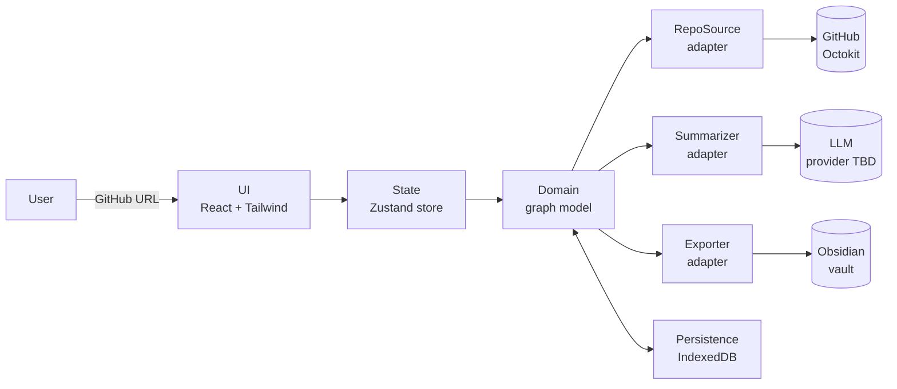

# Architecture

High-level shape of Repository Roadmap. Pairs with [VISION.md](./VISION.md) (the *what* and *why*) and the per-decision ADRs in [`adr/`](./adr/) (the *because*). This file is the *how* and *where*.

## System overview



The user enters a URL; the UI dispatches into Zustand; the domain layer holds the canonical graph; four adapters mediate every external dependency. Persistence sits beside the domain layer and caches across reloads.

## Layers

| Layer | Responsibility | Lives in |
|---|---|---|
| **UI** | React components, Tailwind styling, D3 rendering | `src/components/` |
| **State** | Zustand store, URL state, ephemeral UI flags | `src/store/` |
| **Domain** | Graph model, layer inference, reading-order computation | `src/domain/` *(new in Phase B)* |
| **Adapters** | One file per external dependency (GitHub, LLM, Persistence, Exporter) | `src/adapters/` *(new in Phase A.4 / Phase B onward)* |
| **Parsers** | AST parsing (per-language), import resolution | `src/parsers/` *(new in Phase B)* |

Today everything lives in `src/components/`, `src/store/`, `src/services/`, `src/types/`. Phase A keeps that shape; Phase B introduces the `adapters/` and `domain/` directories cleanly.

## Data flow

`fetch → parse → enrich → render → export`

- **Fetch.** `RepoSource` hits the GitHub Git Trees API once for structure (`?recursive=1`), then fetches file content lazily on node-click or summary-need, through a concurrency-limited queue. See [ADR-0001](./adr/0001-lazy-file-content-fetch.md).
- **Parse.** `parsers/` extract imports/references via AST (oxc for JS/TS — see [ADR-0002](./adr/0002-ast-parser-for-imports.md)). Output: typed edges added to the graph.
- **Enrich.** `Summarizer` produces per-file/per-dir summaries; layer inference tags nodes; git-history adapter overlays churn/recency. All enrichments cache by file SHA in IndexedDB ([ADR-0007](./adr/0007-persistence.md)).
- **Render.** Hybrid layout (tree/dagre for hierarchy + force overlay for cross-cutting edges — see [ADR-0004](./adr/0004-layout-strategy.md)) plus role-driven view filters.
- **Export.** `Exporter` materializes the enriched graph as an Obsidian vault: directory mirror + `.md` notes with YAML frontmatter + `[[wikilinks]]` + a top-level `.canvas` ([ADR-0006](./adr/0006-obsidian-export-format.md)).

## Adapter interfaces

Stable contracts the domain layer programs against. Implementation can swap; the surface can't.

```ts
interface RepoSource {
  getTree(repo: RepoRef): Promise<TreeEntry[]>;
  getContent(repo: RepoRef, sha: string): Promise<Uint8Array>;
}

interface Summarizer {
  summarize(input: { sha: string; path: string; content: string }): Promise<Summary>;
  // Provider-agnostic; cache key includes provider+model+prompt-version.
}

interface Persistence {
  get<T>(key: string): Promise<T | null>;
  set<T>(key: string, value: T, ttlSeconds?: number): Promise<void>;
  // IndexedDB-backed; LRU eviction within browser storage quota.
}

interface Exporter {
  export(graph: Graph, target: ExportTarget): Promise<ExportArtifact>;
  // ExportTarget: 'obsidian-vault' (Phase F); future: 'json', 'graphml'.
}
```

Adapters are introduced *only* when their phase opens. Don't pre-create empty files.

## State model

| Lives in | What's stored | Lifetime |
|---|---|---|
| **Zustand store** | UI flags, current selection, current graph snapshot | Session |
| **IndexedDB** | Fetched content, parse results, summaries, layout snapshots | Cross-session, TTL/LRU |
| **URL** | Repo ref, selected node, view mode, role filter | Shareable, browser history |
| **Ephemeral component state** | Hover, drag, transient animations | Component instance |

Rule: anything a user would expect to survive a reload goes in IndexedDB. Anything they'd expect to copy-paste-and-share goes in the URL. Everything else is Zustand or local component state.

## Extension points

Future capabilities slot in as adapter implementations or as new view modes — no changes to the domain core.

- New language support → new `parsers/<lang>.ts` implementing the `Parser` interface (Phase B+).
- New LLM provider → new `summarizer/<provider>.ts` implementing `Summarizer` (Phase C).
- New export target → new `exporter/<target>.ts` implementing `Exporter` (post-Phase F).
- New role-based reading order → new strategy in `domain/reading-order/<role>.ts` (Phase D).
- New history signal (e.g., test-coverage overlay) → new adapter alongside the git-history one (Phase E+).

## Non-goals (v1)

- **No backend.** Token handling stays browser-side per [ADR-0003](./adr/0003-token-handling.md). Re-evaluate if/when public deploy demands it.
- **No authentication / multi-user.** Each user's IndexedDB is their world.
- **No real-time collaboration.** Single-user, single-tab.
- **No multi-repo cross-graphs.** One repo per session.
- **No write-back to GitHub.** Read-only.
- **No bidirectional Obsidian sync.** Export is one-way in v1; round-trip is post-v1 (see feasibility memo).
